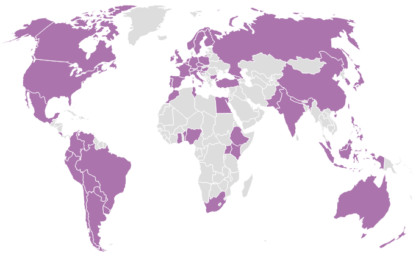

# What is R-Ladies?

## \textbf{\huge R-Ladies Global}

* R-Ladies is a worldwide organization that \textcolor{rladiespurple}{promotes} \textbf{\color{rladiespurple}{gender diversity}} in the R community via \textcolor{rladiespurple}{meetups} and \textcolor{rladiespurple}{mentorship}.

\vspace{2em}

\textit{"The \textbf{mission} of R-Ladies is to achieve proportionate representation by \textbf{encouraging}, \textbf{inspiring}, and \textbf{empowering} people of genders currently underrepresented in the R community."}

\hfill rladies.org/about-us/


---
\vspace{-0.6em}

Started in October 2012 by Gabriela de Queiroz in San Francisco,
 the "R Ladies" concept has expanded to a global franchise
with **131 chapters** in **45 countries** and around **30,000 members**.

\vspace{-0.5em}



## \textbf{\huge R-Ladies Directory}


\Large
* Building a **collaborative global network** of R leaders, mentors, learners and developers is one of the main goals.

* There exists a **centralized** R-Ladies directory.
https://rladies.org/directory/


* Also there exists a directory of R-Ladies **speakers**.
https://rladies.org/r-speakers/

# Some Statistics

## \textbf{\huge Some useRs Stats}
 \Large
 
*  Around \textbf{\textcolor{rladiespurple}{14\%}} of useRs are women (based on the [2017 demographics survey](https://blog.revolutionanalytics.com/downloads/Voice%20of%20R%20Community.pdf) conducted by the R Consortium among 3618 useRs).

* In 2010, \textbf{\textcolor{rladiespurple}{9\%}} of **package authors** were women. (95% CI 7.1-11.0%, based on a 2010 survey with 1087 participants).

* In 2016, \textbf{\textcolor{rladiespurple}{11\% to 15\%}} of **package maintainers** were women (according to an analysis done with the \texttt{\textbf{genderizeR}} package). 


## \textbf{\huge useR! Conferences}

\Large

* Conference participation: \textbf{\textcolor{rladiespurple}{28\%}} of participants at useR!2016 were women.

* The percentage of female presenters at useR!2016 was higher for lightning 
(\textbf{\textcolor{rladiespurple}{25\%}}) and poster (\textbf{\textcolor{rladiespurple}{28\%}}) vs. talks (\textbf{\textcolor{rladiespurple}{19\%}}).

* In 2020 \textbf{\textcolor{rladiespurple}{26\%}} of participants were women.

\vspace{4em}

 \scriptsize Data provided by the R Forwards Women Task Force:\noindent https://forwards.github.io/data/

## \textbf{\huge Keynotes at useR! }

```{r, echo = F}
key <- c(8,7,7,8,8,6,6,6,6,6,7)
keyf <- c(0,1,0,1,1,1,2,2,2,2,4)
df <- data.frame(Year = 2008:2018, Female = keyf, Male = key-keyf)
library(reshape2)
DF1 <- melt(df, id.var="Year")
DF1$variable <- ordered(DF1$variable, levels=c("Male", "Female")) 
library(ggplot2)
bp <- ggplot(DF1, aes(x = Year, y = value, fill = variable)) + 
  geom_bar(stat = "identity")
bp + scale_fill_manual(values=c("#999999", "#88398A"))
```

<!--## Statistics for women in STEM

<!-- * In a survey among useR!2016 participants, two groups of respondents have been highlighted: -->

<!--     - People who do not feel they are part of the R community, but who would like to participate in workshops, or an R user group meeting close to them.   -->

<!--     <!-- They are more likely women, people with master or undergraduate degree. --> 
<!--     - People who feel they are part of the R community, but do not have time to participate to meetings.  -->

<!--    <!--They are more likely men, people with caring responsibilities, or people with a doctorate. --> 

<!-- @RWomenTaskforce -->
<!-- * Underrepresentation in computer science - data for EU, Austria
References:-->


# R-Ladies Vienna

## \textbf{\huge R-Ladies Vienna}
\Large
* Set up in October 2018.

* 416 members of different R proficiencies and different backgrounds.
 
* The aim is to have a meetup around once per month during the semester, to learn new things and foster a network of local R Ladies.


## \textbf{\huge Keep in Touch}

\textcolor{rladiespurple}{\Large \faGlobe}  www.rladies.org or www.meetup.com/rladies-vienna/


\textcolor{rladiespurple}{\large \faEnvelope} vienna@rladies.org or info@rladies.org

\textcolor{rladiespurple}{\Large \faTwitter} @RLadiesVienna and @RLadiesGlobal

\textcolor{rladiespurple}{\Large \faLinkedin} r-ladies-vienna

\textcolor{rladiespurple}{\Large \faSlack} r-ladiesvienna.slack.com

\textcolor{rladiespurple}{\Large \faGithub} @rladies

. . .

\vspace{1em}
\begin{center}
\textit{\textbf{\huge\color{rladiespurple}{{Thanks for listening!}}}}
\end{center}

<!-- <a href="mailto:laurav@rladies.org"><i class="fa fa-paper-plane fa-fw"></i>&nbsp; laurav@rladies.org</a><br> -->
<!-- <a href="mailto:vienna@rladies.org"><i class="fa fa-paper-plane fa-fw"></i>&nbsp; vienna@rladies.org</a><br> -->
<!-- <a href="http://twitter.com/RLadiesVienna"><i class="fa fa-twitter fa-fw"></i>&nbsp; @RLadiesVienna</a><br> -->
<!-- <a href="http://github.com/rladies"><i class="fa fa-github fa-fw"></i>&nbsp; @rladies</a><br> -->

